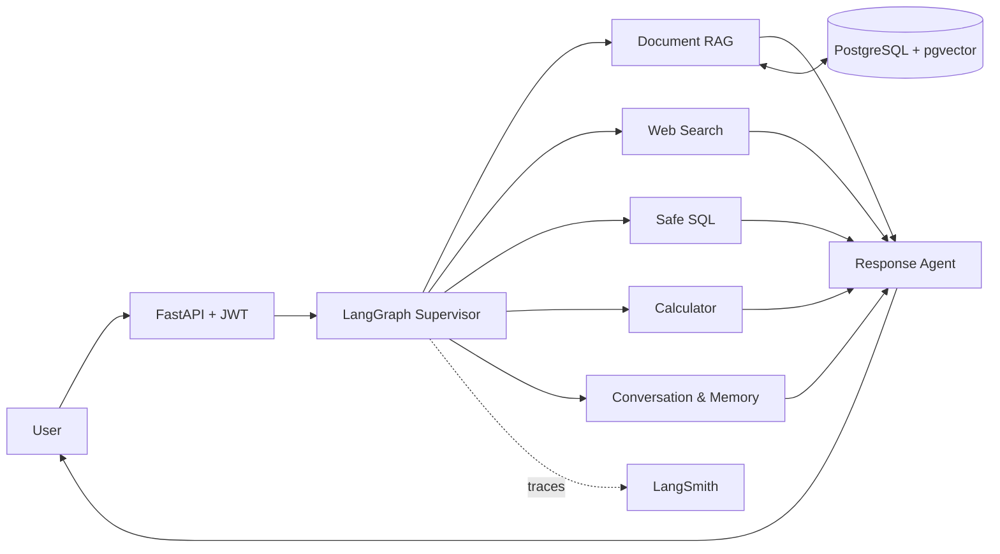

<div align="center">

# Hi, I'm Tulesh Katre 👋

### Python Backend Developer · FastAPI · Django · GenAI & RAG Engineer

I build secure backend platforms and AI-powered applications with production-oriented APIs, retrieval pipelines, agentic workflows, and PostgreSQL.

[](https://www.linkedin.com/in/tulesh-katre-13981b246/)
[](mailto:tuleshkatre592@gmail.com)
[](https://www.naukri.com/mnjuser/profile?id=&altresid)
[](https://www.google.com/maps/place/Indore)

</div>

---

## About Me

I'm a Python Backend Developer with **2 years of professional experience** building secure, maintainable backend systems for web and mobile applications using Python, Django REST Framework, FastAPI, PostgreSQL, and MySQL.

My core work includes REST API design, JWT authentication, role-based access control, database modeling, ORM optimization, WebSocket communication, notifications, payment gateway integrations, OCR, Google Drive integrations, Docker, and AWS deployments. I also build AI-enabled backend features such as document search, RAG, vector retrieval, and agentic workflows when they solve a real product requirement.

- ⚙️ Building scalable APIs and database-backed services with FastAPI and Django REST Framework
- 🔐 Focused on authentication, authorization, validation, testing, and maintainable architecture
- 💬 Experienced with WebSockets, chat, notifications, payment gateways, OCR, and third-party integrations
- ☁️ Deploying containerized Python applications using Docker and AWS
- 🧠 Using **LangChain, LangGraph, LangSmith, pgvector, and RAG** as complementary capabilities for building AI-enabled backend systems
- 🤝 Open to **Python Backend Developer** roles and backend-focused AI product teams

## Flagship Project — AI Assistant

> A secure, observable multi-agent platform for knowledge retrieval, analytics, and conversational intelligence.

This project goes beyond a basic chatbot. A LangGraph supervisor routes requests to specialized document, web, SQL, calculator, conversation, and memory agents. Responses are grounded in retrieved evidence, support true token streaming, preserve tenant boundaries, and expose production telemetry through LangSmith and application metrics.



### Engineering highlights

- **Multi-agent orchestration:** LangGraph routing across document, web, SQL, calculator, conversation, and memory capabilities
- **Production RAG:** PDF ingestion, numeric normalization, semantic retrieval, cross-encoder reranking, grounded answers, and page-level citations
- **Safe SQL analytics:** natural-language query generation, allowlisted relations, tenant-scoped CTEs, SELECT-only validation, and bounded results
- **Three-layer memory:** recent conversation context, incremental summary memory, and consent-based cross-conversation facts
- **True streaming:** plain-text token streaming over Server-Sent Events with separate source metadata
- **Application security:** JWT authentication, RBAC-oriented design, tenant isolation, rate limiting, SQL protection, and trace sanitization
- **Observability:** LangSmith node traces plus rewrite, embedding, retrieval, rerank, SQL, LLM, and total-request latency metrics
- **Quality engineering:** unit, API, integration, retrieval-quality, citation, routing, memory, SQL-safety, and streaming evaluations
- **Deployment:** Docker, GitHub Actions CI, Prometheus metrics, and an AWS ECR/ECS Fargate deployment blueprint

## Other Project Experience

### MedNobAI

Healthcare document and family-record management built with **FastAPI, PostgreSQL, pgvector, OCR, and AI APIs**. It supports prescription, laboratory-report, and document workflows, OCR-based extraction, AI-assisted search, Google Drive integration, and reminders.

### Matrimonial Platform

A Django REST Framework backend covering registration, profiles, partner preferences, interests, subscriptions, match scoring, real-time chat, notifications, payment gateway integration, verification, filters, JWT authentication, and role-based access control.

## Professional Experience

### Python Backend Developer · Evolve Infotech

**January 2025 – Present · Indore, India**

- Develop scalable REST APIs with Django REST Framework and FastAPI
- Implement JWT authentication, role-based access control, and secure validation
- Build WebSocket-based chat, unread-message tracking, and notification workflows
- Design MySQL/PostgreSQL models and optimize ORM queries
- Integrate payment gateways, OCR, AI services, and Google Drive
- Deploy and manage containerized applications on AWS EC2

### Intern Python Backend Developer · Precious Infosystem Pvt. Ltd.

**September 2024 – December 2024 · Indore, India**

- Contributed to Python, Django, and Django REST Framework applications
- Developed REST APIs for business requirements
- Worked on relational databases, debugging, testing, and performance improvements

## Technical Toolkit

| Area | Technologies |
|---|---|
| Languages | Python, SQL |
| Backend | FastAPI, Django, Django REST Framework, REST APIs, WebSockets |
| GenAI | LangChain, LangGraph, LangSmith, RAG, agentic workflows, prompt engineering |
| Vector Search | pgvector, ChromaDB, semantic search, embeddings, cross-encoder reranking, citation grounding |
| Databases | PostgreSQL, MySQL |
| Security | JWT, refresh tokens, RBAC, tenant isolation, input validation, safe SQL |
| Integrations | OCR, AI APIs, Google Drive API, payment gateways |
| DevOps | Docker, GitHub Actions, AWS EC2, ECS Fargate, ECR, Linux, Prometheus |
| Engineering | Pytest, API testing, evaluation datasets, observability, performance metrics |

## What I Bring

```python
tulesh = {
    "role": "Python Backend Developer",
    "experience": "2 years",
    "backend": ["FastAPI", "Django", "DRF", "PostgreSQL"],
    "genai": ["RAG", "LangGraph", "AI Agents", "Memory Systems"],
    "production": ["Security", "Testing", "Observability", "Docker", "AWS"],
    "mindset": "Build reliable systems that solve real business problems",
}
```

I combine practical backend engineering with modern GenAI architecture. That means treating retrieval quality, data isolation, failure handling, observability, and evaluation as core product requirements—not afterthoughts.

## Education

**Bachelor of Technology in Computer Science Engineering**  
SKITM, Indore · 2019–2023

## Let's Connect

I'm interested in teams building backend platforms, AI-enabled products, intelligent search, document intelligence, and agentic systems.

- **LinkedIn:** [linkedin.com/in/tulesh-katre-13981b246](https://www.linkedin.com/in/tulesh-katre-13981b246/)
- **Email:** [tuleshkatre592@gmail.com](mailto:tuleshkatre592@gmail.com)
- **Naukri:** [View my Naukri profile](https://www.naukri.com/mnjuser/profile?id=&altresid)
- **Location:** Indore, Madhya Pradesh, India

<div align="center">

### Building intelligent systems that are secure, grounded, observable, and useful.

</div>
